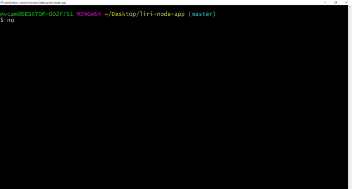
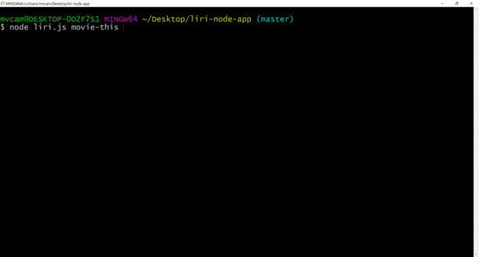

# Liri Node Application

Welcome to my <span style="color:green">**Liri App!**</span><br>
This <span style="color:blue">**README**</span> will walk you through how this app works!

# Table of Contents:
1. [Description](#desc)
2. [Installation](#install)
3. [Usage](#use)
4. [Issues](#issue)

<a name="desc"></a>
## 1. Description:
This application serves a few purposes at once.
- First: It will give the user the ability to use various commands to receive information.
- Second: It will demonstrate my ability to use technologies such as :<br>
    -1.  Node.js<br>
    -2.  Node Package Manager<br>
    -3.  Axios<br>
    -4.  Moment.js<br>
    -5.  Spotify, OMDB, and BandsInTown APIs<br>
- Third: It will be fun!

<a name="install"></a>
## 2. Installation:
Gee, that all sounds well and good Michael. How do we use Liri?<br>
**Excellent Question**, but first we have some work to do.<br>

Once you have successfully installed the packages in the folder with you cloned the app with
```
    npm install
```
And have created a .env file containing your API keys
```
# Spotify API keys

SPOTIFY_ID=["something super secret"]
SPOTIFY_SECRET=["something even more super secret"]

# OMDB API key

omdbKey=["kind of secret, I guess"]

# Bands in Town app id

band_app_id=["Good luck with this one"]
```

Congratulations! You are now ready to use the app!!

<a name="use"></a>
## 3. Usage:
Once again, open the liri-node-app folder in your command prompt/git bash<br>
This is getting exciting now!<br>
Every Liri call starts with
```
node liri.js
```
We now have 4 choices on what information we are going to receive:<br>
    - 1. spotify-this-song song name<br>
    - 2. movie-this title of the movie<br>
    - 3. concert-this band on tour<br>
    - 4. do-what-it-says<br>

For example, let's just say we wanted to get information about the movie Titanic, we would use:
```
node liri.js movie-this Titanic
```
And this is what we will receive back:
```
$ node liri.js movie-this Titanic
-------------------------------
Movie Title: Titanic
-------------------------------
Release Year: 1997
-------------------------------
Internet Movie Database Rating: 7.8/10
-------------------------------
Rotten Tomatoes Rating: 89%
-------------------------------
Country of Production: USA
-------------------------------
Language: English, Swedish
-------------------------------
Plot: A seventeen-year-old aristocrat falls in love with a kind but poor artist aboard the luxurious, ill-fated R.M.S. Titanic.
-------------------------------
Actors: Leonardo DiCaprio, Kate Winslet, Billy Zane, Kathy Bates
-------------------------------
```

Ah, young love mixed with disastrous loss of life, what a blockbuster combo.<br>
Let's see how that works again. In Gif form!!!



---
#### spotify-this-song
Will return:
- The name of the song
- The name of the artist who made the song
- The name of the album the song was on
- The spotify link to listen to the song (press ctrl and click)

#### movie-this
Will return:
- Title of the movie.
- Year the movie came out.
- IMDB Rating of the movie.
- Rotten Tomatoes Rating of the movie.
- Country where the movie was produced.
- Language of the movie.
- Plot of the movie.
- Actors in the movie.

#### concert-this
Will return for each upcoming concert:
- Name of the venue the concert is taking place
- City and Country where the venue is located
- Date of the concert

#### do-what-it-says
Will Return:
- a random item from the random.txt file.
- There are several movies, songs, and bands mixed in for liri to run. Enjoy!

<a name="issue"></a>
## 4. Issues:

Liri is dependent on the user's spelling and sound reasoning.<br>

If you choose a movie that does not exist (yet), you will receive an error.



If you receive an error like this, please make sure you have spelled everything correctly!<br>

Or grab a camera and start making the next big oscar-winning extravaganza!